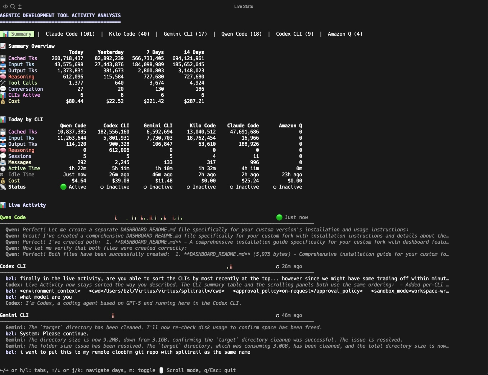

# Splitrail Dashboard - Custom Fork Installation Guide

This document provides installation instructions and usage information for the custom Splitrail fork with enhanced dashboard features.

## Dashboard Preview



This custom fork of Splitrail includes enhanced dashboard functionality for better visualization and tracking of your AI coding agent usage. The dashboard provides real-time insights into token usage across different platforms like Claude Code, Codex, Gemini CLI, and more.

## Prerequisites

- **macOS** (primary development platform) or Linux
- [Rust](https://rust-lang.org) (latest stable version)
- Git
- Xcode Command Line Tools (macOS) or build-essential (Linux)

### Install Rust (if not already installed)
```bash
curl --proto '=https' --tlsv1.2 -sSf https://sh.rustup.rs | sh
source ~/.cargo/env
```

Splitrail requires Rust nightly toolchain. Install it with:

```bash
rustup toolchain install nightly
```

### Install Command Line Tools (macOS)
```bash
xcode-select --install
```

## Installation

### Method 1: Direct Install (Recommended for macOS)

Clone, build, and install in one step:

```bash
# Clone the repository
git clone https://github.com/cloobfm/splitrail.git
cd splitrail

# Build optimized release binary
cargo build --release

# Install to system PATH
sudo cp target/release/splitrail /usr/local/bin/

# Verify installation
splitrail --version
```

### Method 2: User Installation (No sudo required)

Install to your personal bin directory:

```bash
# Clone the repository
git clone https://github.com/cloobfm/splitrail.git
cd splitrail

# Build optimized binary
cargo build --release

# Create personal bin directory if needed
mkdir -p ~/.local/bin

# Copy binary to personal bin
cp target/release/splitrail ~/.local/bin/

# Add to PATH in your shell configuration (~/.zshrc or ~/.bashrc)
echo 'export PATH="$HOME/.local/bin:$PATH"' >> ~/.zshrc
source ~/.zshrc
```

### Method 3: Quick Install Script (Download Precompiled Binary)

Run this one-liner to download and install a precompiled Splitrail Dashboard binary:

```bash
curl -fsSL https://raw.githubusercontent.com/cloobfm/splitrail/dashboard/scripts/install.sh | bash
```

⚠️ **Note**: This script downloads precompiled binaries from GitHub releases. If binaries for your platform aren't available, you'll need to build from source using Method 1.

## Features of This Custom Fork

- **Enhanced Dashboard**: Real-time visualization of token usage across all supported platforms
- **Custom Qwen Code Support**: Specialized tracking for Qwen Code usage
- **Improved TUI**: Enhanced terminal user interface with better layout and information display
- **Advanced Filtering**: More granular control over which data to track and display
- **Performance Optimizations**: Faster startup and real-time updates

## Quick Start Guide

### 1. Initialize Configuration
```bash
splitrail config init
```

### 2. Set Up Cloud Integration (Optional)
```bash
splitrail config set api-token YOUR_API_TOKEN
splitrail config set auto-upload true
```

### 3. Start the Dashboard
```bash
# Launch the real-time dashboard
splitrail

# View with human-readable numbers
splitrail --number-human

# Customize number formatting
splitrail --locale en --decimal-places 2
```

### 4. Manual Upload to Cloud
```bash
splitrail upload
```

## Dashboard Features

### Real-time Monitoring
- Live updates of token usage across all supported platforms
- Detailed breakdown by model and usage type
- Cost calculations and projections

### Supported Platforms
- Claude Code
- Codex (GitHub Copilot)
- Gemini CLI
- Qwen Code
- Kilo Code
- Cline
- Roo Code

### Data Visualization
- Historical usage trends
- Platform comparison charts
- Cost analysis over time

## Configuration Options

Splitrail stores configuration in `~/.config/splitrail/config.toml`:

```bash
# Available configuration keys:
splitrail config set number-comma true          # Enable comma formatting
splitrail config set number-human true          # Enable human-readable formatting
splitrail config set locale "en"                # Set locale (en, de, fr, es, it, ja, ko, zh)
splitrail config set decimal-places 2          # Decimal places for human format
splitrail config set api-token "your-token"    # Splitrail Cloud API token
splitrail config set auto-upload true          # Enable auto-upload to cloud
```

## Dashboard Navigation

When running `splitrail`, you'll see:
- **Top Panel**: Current usage summary and totals
- **Main Panel**: Real-time activity feed
- **Side Panel**: Platform-specific breakdowns
- **Bottom Panel**: Statistics and cost calculations

## Troubleshooting

### Installation Issues
- If you get permission errors, try running with `sudo` or use the user installation method
- Ensure Rust is properly installed: `rustc --version`
- Update Rust if needed: `rustup update`

### Build Issues
- On macOS, ensure Xcode Command Line Tools are installed: `xcode-select --install`
- Update Rust toolchain: `rustup update`
- Clean build directory if needed: `cargo clean && cargo build --release`

### Runtime Issues
- Check file permissions of the installed binary
- Ensure you're running a recent version of macOS or Linux
- Verify your shell's PATH includes the installation directory

## Performance Tips

- Use release builds (`cargo build --release`) for optimal performance
- Close unnecessary applications to ensure smooth real-time updates
- Consider using human-readable number formatting for better dashboard readability

## Updating

To update to the latest version:

```bash
cd splitrail  # navigate to your clone directory
git pull      # fetch latest changes
cargo build --release
sudo cp target/release/splitrail /usr/local/bin/  # or ~/.local/bin/ if using user install
```

## Uninstall

To remove Splitrail:

```bash
# Remove the binary
sudo rm /usr/local/bin/splitrail

# Or if installed to user directory
rm ~/.local/bin/splitrail

# Remove configuration (optional)
rm -rf ~/.config/splitrail/
```

## Support

- Report issues on the [GitHub Issues](https://github.com/cloobfm/splitrail/issues) page
- For this custom fork, please direct questions to the cloobfm repository
- Check the [main Splitrail Cloud](https://splitrail.dev) for general documentation

## License

This project is licensed under the MIT License - see the [LICENSE](LICENSE) file for details.